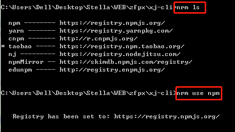
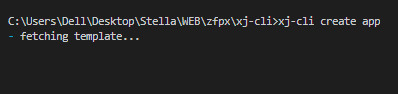
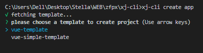
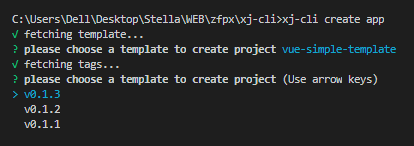
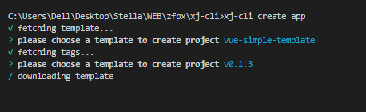
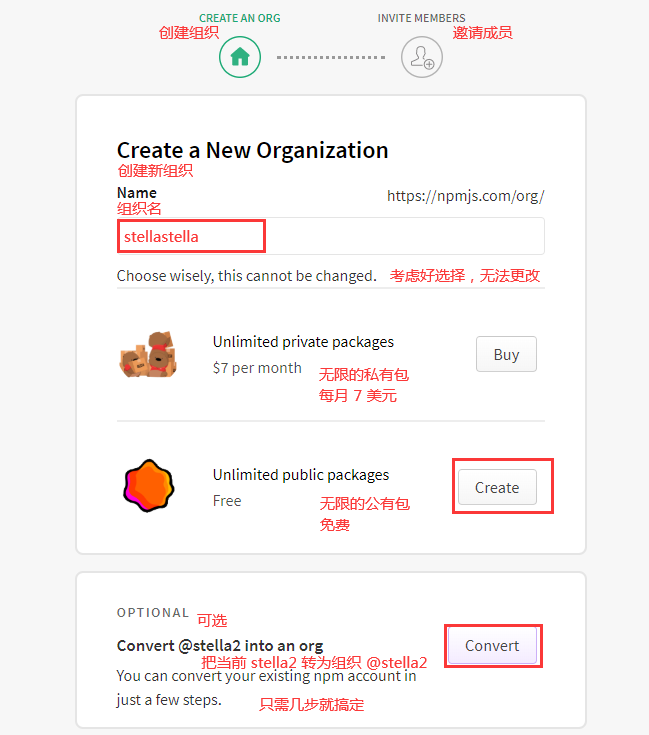

# 实现简易的 CLI
**CLI** 全称 command-line interface 命令行界面，通常不支持鼠标，用户通过键盘输入指令，计算机收到指令，予以执行。

本文结合 **vue-cli**，**create-react-app** 即脚手架，定制个人项目脚手架，快速创建初始化项目文件。

定制脚手架初衷：
1. 快速搭建项目初始化文件；
2. 统一代码规范。

> Tip: 文章旨在记录个人开发 cli 的经验。后续文章提及的 xj-cli 为个人开发脚手架示例，可在 [npm](https://www.npmjs.com/) 上 download 之后，就能快速生成项目。

## xj-cli
开发之前，需创建一个 Github 组织 organization 账户（如果你有，即可跳过）。先创建一个普通 Github 账户，并升级为 organization 组织账户，后续会将个人初始化后的项目放入该组织账户下，供脚手架逻辑使用。

### 下载依赖包
- `axios`: http 库
- `commander`: 命令行参数解析
- `consolidate`: 统一模板引擎
- `download-git-repo`: 下载并提取出 Git 仓库代码
- `ejs`: 模板引擎
- `inquirer`: 交互式命令行，实现命令行选择功能
- `metalsmith`: 极简、插件化的静态站点生成器

**Metalsmith** (译自官网)
为什么 Metalsmith 是一个插件化的静态站点生成器？
- 从事源码目录中读取源文件，抽取信息；
- 可操作抽取的信息；
- 将操作后的信息写入文件，最后移至目标目录。

### 初始化文件

#### 目录
```
├── bin
│   └── www  
├── package.json
├── src
│   ├── main.js 
│   ├── create.js   
│   ├── config.js   
│   └── constants.js  
```

#### 配置项
**package.json**
  
package.json 是整个项目的配置文件，通过命令行 **npm init -y** 快速生成。
```json
"bin": {
  "xj-cli": "./bin/www"
},
""
```

> Tip: **bin** 属性是为包配置执行环境与入口文件，在 shell 下执行 xj-cli 时就能调用 bin 目录下的 www 文件

**bin/www**
```js
#! /usr/bin/env node
require('../src/main.js');
```

> Tip: 顶部需添加 **#! /usr/bin/env node**，标识命令行输入 **xj-cli** 时，以 `node` 环境执行此文件

#### 链接全局包
该步骤是将当前 xj-cli 临时配置到执行环境变量中，实现在任意目录 shell 下都能执行 **xj-cli** 命令。

```bash
npm link
```

#### 核心代码
**功能**
- xj-cli --version 查看版本号
- xj-cli --help 查看帮助
- xj-cli config xxx 设置配置项
- xj-cli create xxx 创建项目

**constants.js**
```js
const { version } = require('../package.json');

const downloadDirectory = `${process.env[process.platform === 'darwin' ? 'HOME' : 'USERPROFILE']}/.template`

module.exports = {
  version,
  downloadDirectory,
};
```
> 导出版本号，下载创建项目缓存目录

```js
const program = require('commander');
const path = require('path');
const { version } = require('./constants');

const mapActions = {
  create: {
    alias: 'cre',
    description: 'create a project',
    examples: [
      'xj-cli create <project-name>',
    ],
  },
  config: {
    alias: 'conf',
    description: 'config project variable',
    examples: [
      'xj-cli config set <k> <v>',
      'xj-cli config get <k>',
    ],
  },
  '*': {
    alias: '',
    description: 'command not found',
    examples: [],
  },
};

Reflect
  .ownKeys(mapActions)
  .forEach(
    (action) => {
      program
        .command(action)
        .alias(mapActions[action].alias)
        .description(mapActions[action].description)
        .action(() => {
          if (action === '*') {
            console.log(mapActions[action].description);
          } else {
            require(path.resolve(__dirname, action))(...process.argv.slice(3));
          }
        });
    },
  );

program.on('--help', () => {
  console.log('\nExamples:');
  Reflect.ownKeys(mapActions).forEach((action) => {
    mapActions[action].examples.forEach((example) => console.log(`  ${example}`));
  });
});

program
  .version(version)
  .parse(process.argv);

```

**create.js**
引入依赖文件
```js
const axios = require('axios');
const ora = require('ora');
const Inquirer = require('inquirer');
let downloadGitRepo = require('download-git-repo');
const fs = require('fs');
const { promisify } = require('util');
const path = require('path');
const MetalSmith = require('metalsmith');
let { render } = require('consolidate').ejs;
const ncp = require('ncp');
const { downloadDirectory } = require('./constants');
```

包装原函数为返回 promise 对象的新函数，避免回调函数嵌套
```js
render = promisify(render);
downloadGitRepo = promisify(downloadGitRepo);
```

异步获取仓库项目列表，tag 列表
```js
const fetchRepoList = async () => {
  const { data } = await axios.get('https://api.github.com/orgs/xj-cli/repos');
  return data;
};

const fetchTagList = async (repo) => {
  const { data } = await axios.get(`https://api.github.com/repos/xj-cli/${repo}/tags`);
  return data;
};
```

基于函数柯里化设计模式，封装异步获取前后的 loading 图标显示
```js
const waitFnLoading = (fn, message) => async (...args) => {
  const spinner = ora(message);
  spinner.start();
  const result = await fn(...args);
  spinner.succeed();
  return result;
};

const download = async (repo, tag) => {
  let api = `xj-cli/${repo}`;
  if (tag) {
    api += `#${tag}`;
  }
  const dest = `${downloadDirectory}/${repo}`;
  await downloadGitRepo(api, dest);
  return dest;
};

function checkProjectName(projectName) {
  if (!projectName) {
    console.error('请输入要创建的项目名称');
    return false;
  }
  return true;
}
```

导出一个函数，接收项目名，开始远程拉取项目，进行创建
- 拉取项目列表名，交互式问答得出用户想要下载的项目名
- 拉取用户选择的项目 tag 版本号
- 下载代码缓存在本地，并在当前目录下生成项目

```js
module.exports = async (projectName) => {
  if (!checkProjectName(projectName)) return;

  let repos = await waitFnLoading(fetchRepoList, 'fetching template...')();
  repos = repos.map((item) => item.name);
  const { repo } = await Inquirer.prompt({
    name: 'repo',
    type: 'list',
    message: 'please choose a template to create project',
    choices: repos,
  });
  let tags = await waitFnLoading(fetchTagList, 'fetching tags...')(repo);
  tags = tags.map((item) => item.name);

  const { tag } = await Inquirer.prompt({
    name: 'tag',
    type: 'list',
    message: 'please choose a template to create project',
    choices: tags,
  });

  const result = await waitFnLoading(download, 'downloading template')(repo, tag);
  if (!fs.existsSync(path.join(result, 'ask.js'))) {
    await ncp(result, path.resolve(projectName));
  } else {
    await new Promise((resolve, reject) => {
      MetalSmith(__dirname)
        .source(result)
        .destination(path.resolve(projectName))
        .use(async (files, metal, done) => {
          const args = require(path.join(result, 'ask.js'));
          const obj = await Inquirer.prompt(args);
          const meta = metal.metadata();
          Object.assign(meta, obj);
          Reflect.deleteProperty(files, 'ask.js');
          done();
        })
        .use((files, metal, done) => {
          const obj = metal.metadata();
          Reflect.ownKeys(files).forEach(async (file) => {
            if (file.includes('js') || file.includes('json')) {
              let content = files[file].contents.toString();
              if (content.includes('<%')) {
                content = await render(content, obj);
                files[file].contents = Buffer.from(content);
              }
            }
          });
          done();
        })
        .build((err) => {
          if (err) {
            reject();
          } else {
            resolve();
          }
        })
    });
  }
};

```


### 发包
```bash
nrm use npm
npm login
npm publish
```
> Tip: 登录 npm 账号前，切换到npm 源下



### 使用
全局安装 xj-cli 包
```bash
nmp i xj-cli -g
```

下载包
```bash
xj-cli create app
```









到这里核心功能实现了，后续有其他命令可在此基础上扩展即可。

### 补充
如果发布 `scoped packages` 作用域包到 **NPM** 包管理器上，点击 [创建scoped packages](https://www.npmjs.com/org/create)，通过以下步骤即可把当前的 **user** 转成 **org** 组织（如图）：


- 输入要新创建的 **org** 名，如：stellastella
- 勾选 **FREE** 选项
-（可选）**CONVERT**
    - 勾选，将当前的个人账号 @stella2 转为 **org**，新创建的 stellastella 为个人账号